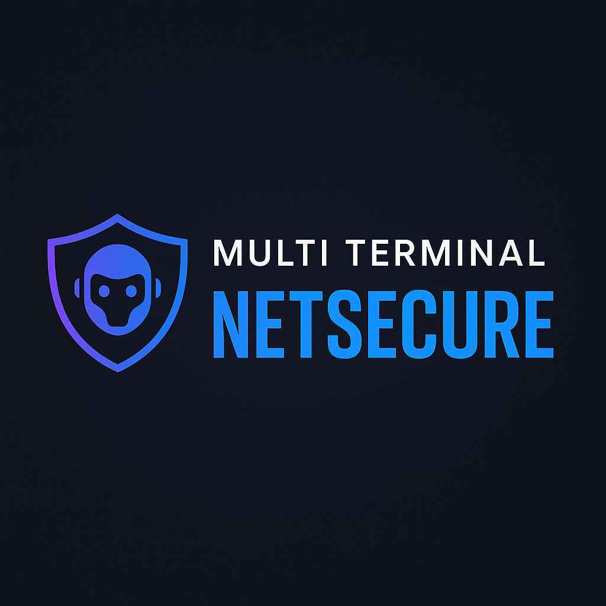

<p align="center">
  
</p>

# Multi Terminal NetSecure

Terminal IA pour Termux avec FastAPI, détection intelligente et automatisation CLI.

---

## Fonctionnalités principales

- Interface Terminal IA (menu interactif)
- API FastAPI pour la gestion d'emprunts
- Détection automatique des binaires exécutables
- Historique et exécution des commandes
- Support JSON / SQLite / PDF (à venir)
- Mini terminal Python intégré

---

## Structure du projet

```
multi_terminal_netsecure/
├── bin/                   # Script principal multi_terminal_netsecure.sh
├── scripts/              # mini_terminal_avance.py, outils de détection
├── app/                  # Backend FastAPI (main.py, endpoints, db)
├── docs/                 # Bannières, visuels
├── .gitignore
├── LICENSE
└── README.md
```

---

## Lancement rapide

```bash
chmod +x bin/multi_terminal_netsecure.sh
./bin/multi_terminal_netsecure.sh
```

---

## Lancer manuellement FastAPI

```bash
cd app
uvicorn main:app --host 0.0.0.0 --port 8000
```

---

## À propos

Développé par **Mohammed Zoubirou**  
GitHub : [https://github.com/milyes](https://github.com/milyes)

Licence : Propriétaire NetSecurePro  
Voir le fichier `NETSECUREPRO_LICENSE.txt`

---

<p align="center">
  
</p>
